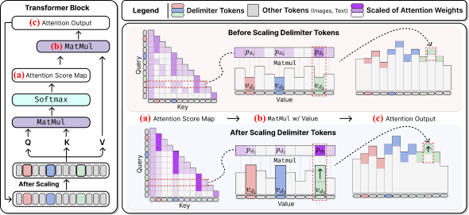

# Enhancing Multi-Image Understanding Through Delimiter Token Scaling (ICLR 2026)

by [Minyoung Lee](https://sites.google.com/view/minyoung-lee), [Yeji Park](https://yejipark-m.github.io/), [Dongjun Hwang](https://dongjunhwang.github.io/), [Yejin Kim](https://sites.google.com/view/yejin-c-kim/),[Seong Joon Oh](https://coallaoh.github.io/), [Junsuk Choe](https://sites.google.com/site/junsukchoe/)

This repository contains the code for the paper **["Enhancing Multi-Image Understanding Through Delimiter Token Scaling"](https://openreview.net/forum?id=7QFf05KrOm)** presented at ICLR 2026.

> **Abstract**: Large Vision-Language Models (LVLMs) achieve strong performance on single-image tasks, but their performance declines when multiple images are provided as input. One major reason is the cross-image information leakage, where the model struggles to distinguish information across different images. Existing LVLMs already employ delimiter tokens to mark the start and end of each image, yet our analysis reveals that these tokens fail to effectively block cross-image information leakage. To enhance their effectiveness, we propose a method that scales the hidden states of delimiter tokens. This enhances the model’s ability to preserve image-specific information by reinforcing intra-image interaction and limiting undesired cross-image interactions. Consequently, the model is better able to distinguish between images and reason over them more accurately. Experiments show performance gains on multi-image benchmarks such as Mantis, MuirBench, MIRB and QBench2. We further evaluate our method on text-only tasks that require clear distinction. The method improves performance on multi-document and multi-table understanding benchmarks, including TQABench, MultiNews and WCEP-10. Notably, our method requires no additional training or inference cost.

## TODO / Code Release Plan

We are in the process of cleaning up and preparing the codebase for public release.
The following components will be released progressively:

- [ ] **Multi-image understanding evaluation code**  
  (Delimiter token scaling integrated into LVLM inference and evaluation pipelines)

- [ ] **LLM benchmark code**  
  (Multi-document and multi-table benchmarks including TQABench, MultiNews, and WCEP-10)

- [ ] **Visualization code**  
  (Attention maps and interaction analysis for delimiter tokens)

The full code will be released upon final preparation.

## Acknowledgments
Our code is based on [lmms-eval](https://github.com/EvolvingLMMs-Lab/lmms-eval) and [Transformer](https://github.com/huggingface/transformers).
If you use our work, please consider citing the above works as well.